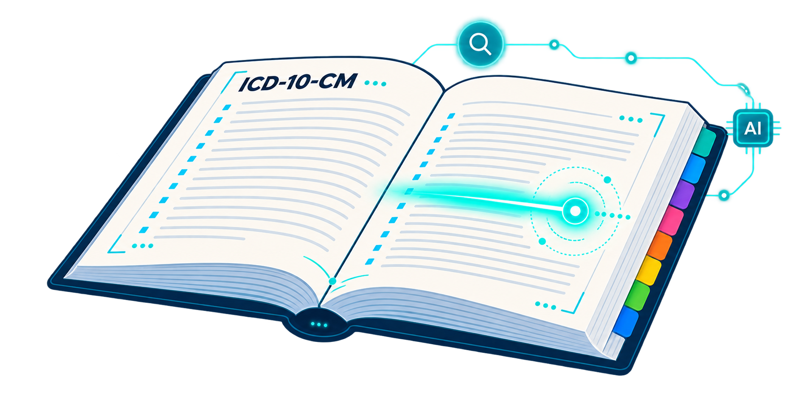
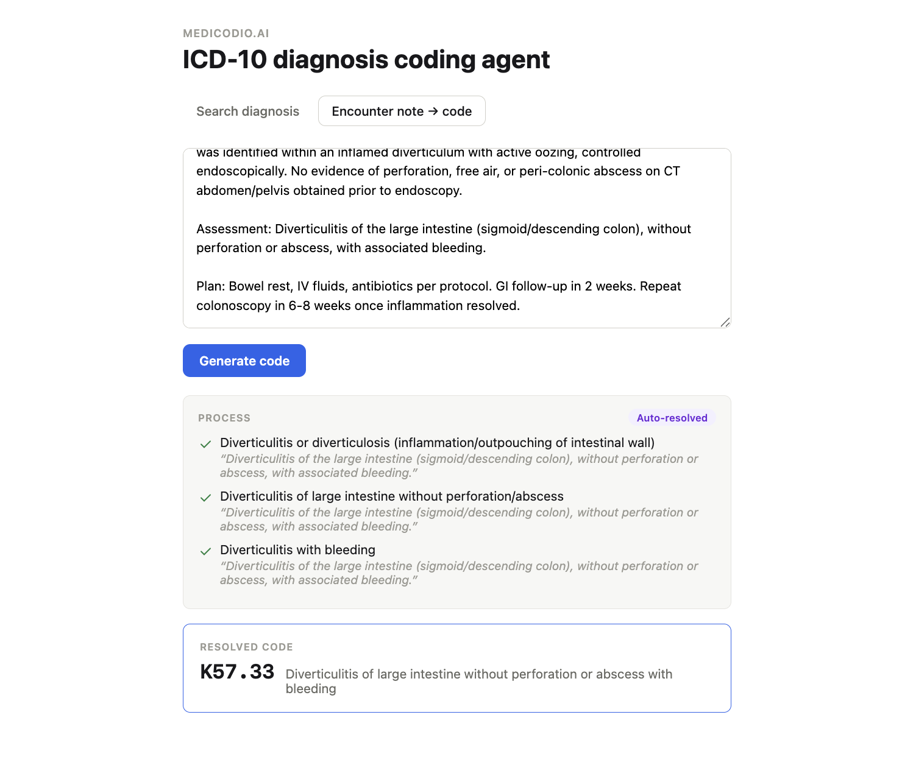

# Socrates — nextgen-codio-engine edition

<p align="center">
  
</p>

**Author:** Sanjeev Ragunathan · [LinkedIn](https://www.linkedin.com/in/sanjeev-ragunathan) · [GitHub](https://www.github.com/sanjeev-ragunathan)

Socrates turns a diagnosis or a full clinical note into a precise, billable ICD-10-CM
code — with a clear, auditable trail of how it got there.

Type "hip pain" and it'll ask you which hip. Paste a whole encounter note and
it'll read it, work out what's actually being diagnosed, and resolve straight
through to the exact code — narrowing from thousands of possibilities down to
one, and quoting the exact sentence in the note that justified every step
along the way.

## Why "Socrates"?

Socrates didn't lecture people into the truth. He asked them a sequence of
precise questions, and let their own answers rule out everything that
couldn't be true until only the answer was left. That's the Socratic method,
and it's exactly how this system codes:

- **It never proposes a code.** The candidates come only from the official
  CMS ICD-10-CM code set, found by a deterministic search.
- **It asks, one question at a time.** Each question is multiple choice,
  and its options split the real candidates, e.g. "Is the bleeding
  documented?" or "Which hip?".
- **The chart answers.** Each answer must quote the note word for word, and
  the quote is checked against the note. If the chart doesn't say, that's a
  valid answer too; it isn't a cue to guess.
- **It narrows until one billable code is left.**

The usual approach is a tree: pick a chapter, then a section, then a code.
If the first answer is wrong, every step after it searches the wrong branch.
Socrates makes no such early commitment. Every plausible code stays in play
until the chart's own words rule it out.

## Why it's trustworthy

Every code this system returns comes from the official CMS ICD-10-CM Tabular
List and Alphabetical Index — not a guess, not a hallucinated code. The
search itself is fully deterministic and runs with zero AI involvement.

AI only enters the picture when a diagnosis is genuinely ambiguous, and even
then it never picks a code out of thin air — it asks one clarifying
multiple-choice question at a time, built strictly from the real candidates
the deterministic search already found, and answers are grounded in the
note's actual language. Every question, every answer, and every supporting
quote is kept in a full trace, so you can see exactly why a code was chosen.

## Two ways to use it

**A web app**, with two modes:
- **Search a diagnosis** — type what you're looking for, answer a short
  clarifying question or two, get your code.
- **Paste an encounter note** — the whole note-to-code loop runs
  automatically, with live progress as it works, ending in a resolved code
  and its full supporting trace.



**A command line**, for the same two flows:
```bash
.venv/bin/python cli.py                                      # search, you answer the questions
.venv/bin/python cli_diagnosis.py sample_notes/<file>.txt     # paste a note, AI answers from it
```

## Getting started

1. **Build the code databases** (once, from the included CMS source files --
   one per fiscal year, FY2026 and FY2027):
   ```bash
   DYLD_LIBRARY_PATH=/opt/homebrew/opt/expat/lib python3.12 scripts/build_db.py
   ```
2. **Set up the environment:**
   ```bash
   DYLD_LIBRARY_PATH=/opt/homebrew/opt/expat/lib python3.12 -m venv .venv
   DYLD_LIBRARY_PATH=/opt/homebrew/opt/expat/lib .venv/bin/pip install anthropic pydantic fastapi uvicorn
   ```
3. **Add your API key** to a `.env` file at the project root:
   ```
   ANTHROPIC_API_KEY=sk-ant-...
   CLAUDE_MODEL_FAST=claude-haiku-4-5-20251001
   CLAUDE_MODEL_REASONING=claude-opus-5
   ```
4. **Run it:**
   ```bash
   # CLI
   .venv/bin/python cli.py

   # or the web app
   .venv/bin/uvicorn api:app --port 8000
   cd frontend && npm install && npm run dev
   ```

> macOS/Homebrew note: this machine's Python needs
> `DYLD_LIBRARY_PATH=/opt/homebrew/opt/expat/lib` set for anything that talks
> to the model or parses XML — `cli.py`/`cli_diagnosis.py` handle this
> automatically. See `docs/ARCHITECTURE.md` if you hit it elsewhere.

## Want to know how it works?

For more info, check out the [`docs/`](docs/) folder:

- [`docs/DEMO_SEMI_AUTOMATED.md`](docs/DEMO_SEMI_AUTOMATED.md) — walkthrough
  of the Search diagnosis mode, with screenshots, and where it helps a human
  coder.
- [`docs/DEMO_AUTOMATED.md`](docs/DEMO_AUTOMATED.md) — walkthrough of the
  Encounter note → code mode, with screenshots, and where it helps.
- [`POC.md`](POC.md) — the proof of concept: idea, results, cost and the integration plan.
- [`docs/INTEGRATION.md`](docs/INTEGRATION.md) — how to plug it into
  nextgen-codio-engine's ICD pipeline, one diagnosis at a time.
- [`docs/ARCHITECTURE.md`](docs/ARCHITECTURE.md) — full technical
  reference: setup, project layout, how the search-ranking pipeline works,
  how the clarifying-question loop is grounded and validated, and the web
  API design.

## Origin

Socrates started as the `icd-coder` folder of the
[`medicodio-interview`](https://github.com/sanjeev-r-medicodio/medicodio-interview)
repository and was extracted into this repo with its commit history. PR
numbers in commit messages (#1–#13) refer to that repository.
