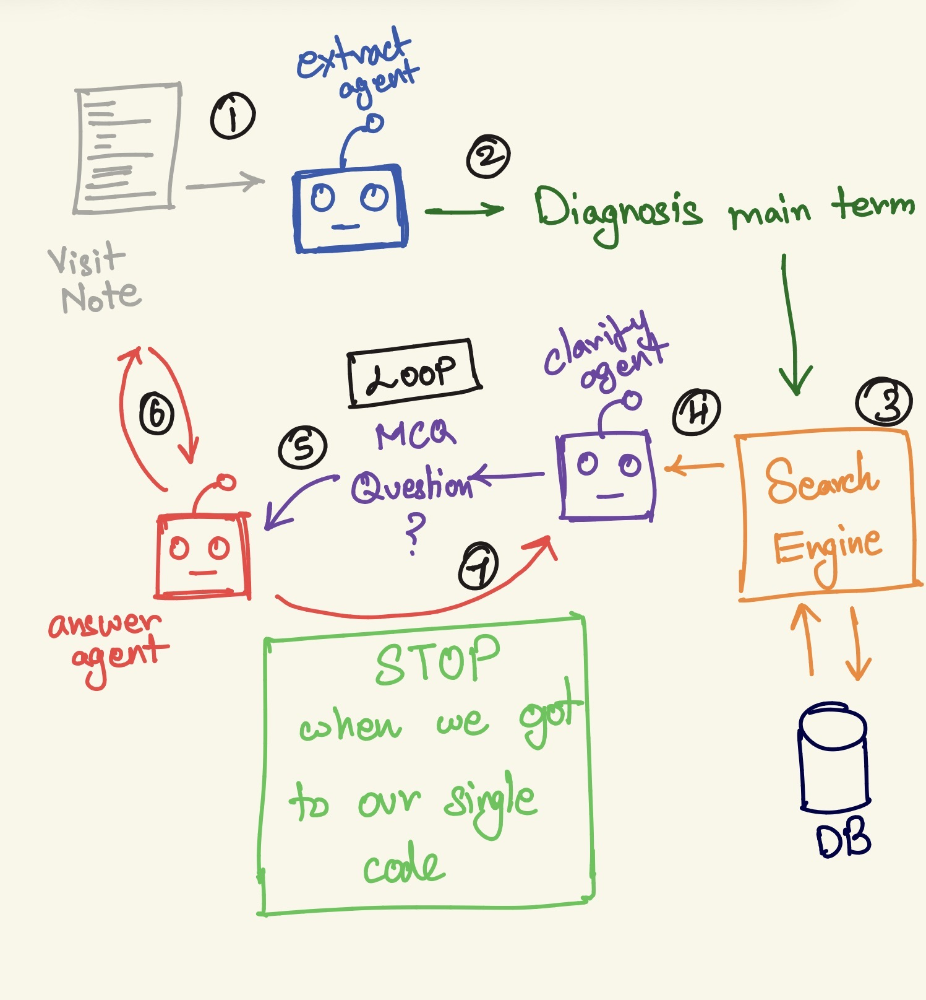
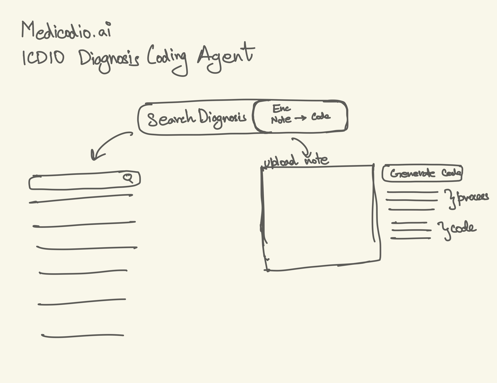

# Creator's Note

## Initial plan

The first sketch had three separate agents (extract, clarify, answer)
looping between the search engine and the note. Turned out one agent doing
each job in sequence was simpler and just as effective — no need for three.

## Web UI

Rough scratch of the two-tab layout — search diagnosis and encounter note
→ code — done on an iPad before any real design work.

