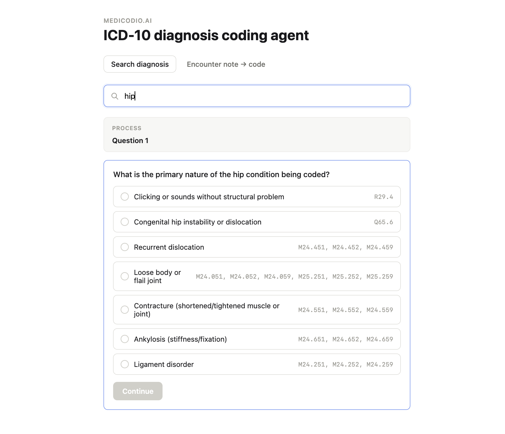
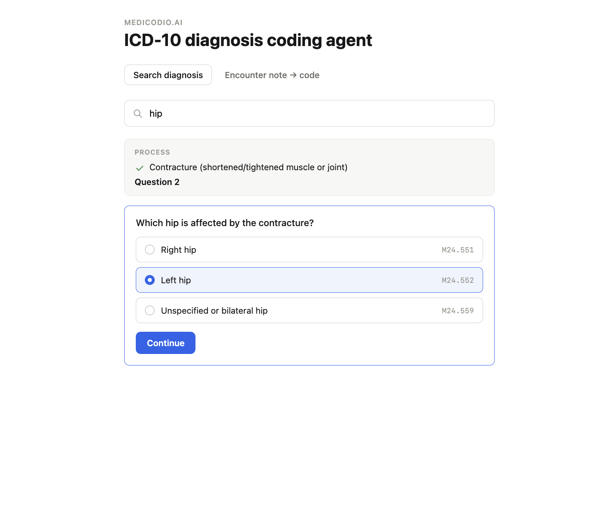
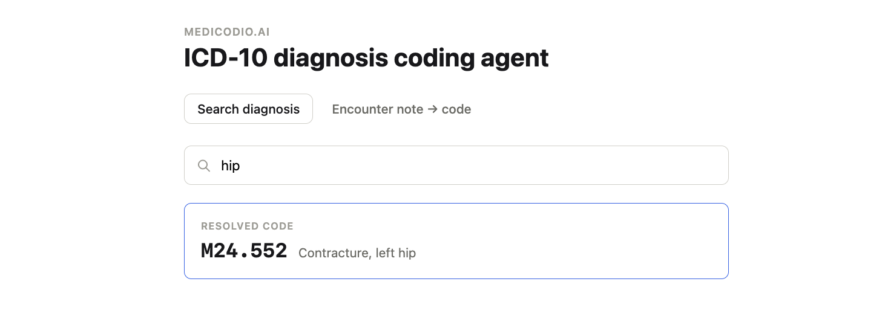

# Demo: Search Diagnosis (semi-automated)

This is the **Search diagnosis** tab in the web app (same flow as `cli.py`
on the command line). You type what you're looking for, the system narrows
it down with clarifying questions, and you answer each one — the AI never
picks the diagnosis for you here, it only asks the right questions and
tracks the candidates.

## Walkthrough

**1. Type a diagnosis.** Something as short as "hip" is enough to start —
there's no need to already know the exact clinical term. The system finds
every ICD-10-CM code family that could match and asks the first clarifying
question, grouping dozens of candidate codes into a handful of plain-English
options.

**2. Answer, and it narrows further.** Each answer collapses the candidate
list and immediately asks the next question needed to keep narrowing — here,
after picking "Contracture," it already knows to ask specifically about
laterality, with the exact codes for each side shown next to the option.

**3. Done.** Once the candidates narrow to exactly one code, it stops asking
and shows the resolved code with its full description.

## Where this helps

A human coder using the physical ICD-10-CM codebook (or an unstructured
digital copy) has to already know roughly where to look, then manually flip
between the Alphabetical Index and the Tabular List, checking notes,
exclusions, and 7th-character requirements by hand — for every case, all day.

This mode turns that into a short, guided conversation: type what you're
looking for in plain language, answer a couple of targeted multiple-choice
questions, get the exact billable code. It's not a replacement for the
coder's judgment — they're the one answering every question — but it
replaces the manual page-flipping and cross-referencing with something that
takes seconds instead of minutes, especially for code families most people
don't code often enough to have memorized (like the M24 joint-derangement
family shown above, with 7+ subcategories most coders would otherwise have
to look up one at a time).
